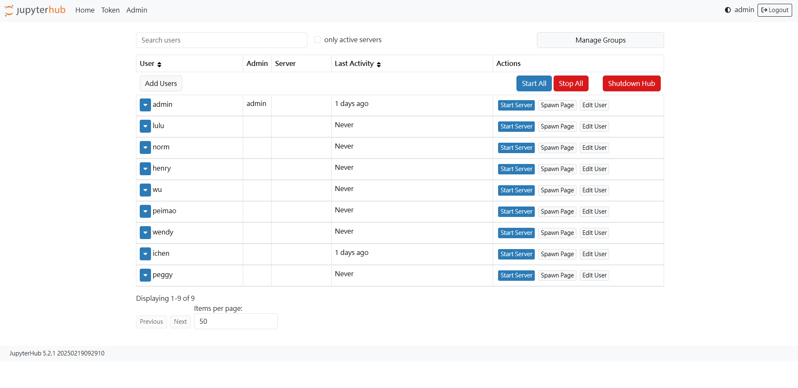
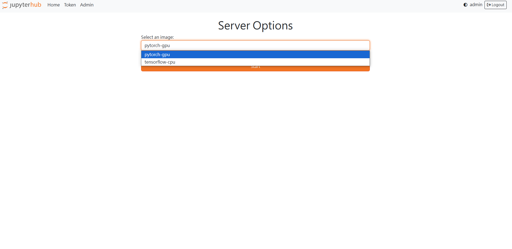
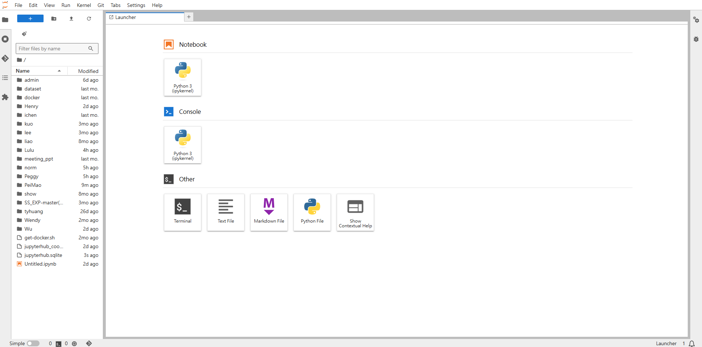

# DataLab – Multi‑User JupyterHub Stack

A lightweight, container‑based development environment that lets multiple users spin up isolated **JupyterLab** workspaces with GPU/CPU images (PyTorch, TensorFlow, etc.).

---

## 📂 Project Layout

```
DataLab/
 ├── env/                  # Dockerfiles for user images
 │   └── JupyPytorch/      #   • peimao/env/pytorch-notebook:latest
 ├── docker-compose.yaml   # Orchestration for Hub, Proxy & user containers
 ├── Dockerfile            # (Optional) base image used by env/* builds
 ├── jupyterhub_config.py  # Spawner & Auth configuration
 ├── run_datalab.sh        # One‑shot build & launch script
 └── *.PNG                 # Screenshots for documentation
```

---

## 🚀 Quick Start

```bash
# 1. Clone / copy DataLab to your server
# 2. Inside DataLab, make the script executable & run it
chmod +x run_datalab.sh
./run_datalab.sh
```
The script will:
1. Build `peimao/env/pytorch-notebook:latest` from **env/JupyPytorch**
2. Run `docker‑compose build --no-cache` for all services
3. Bring the stack up in detached mode

Access the Hub at **http://<server‑ip>:8000** (adjust port if you changed it in `docker-compose.yaml`).

---

## 🔐 Managing Users (Admin view)



* **Add Users** – bulk‑create accounts from the web UI or via the REST API
* **Start/Stop Server** – launch / terminate a user’s container on demand
* **Spawn Page** – open the server options users see (images, resources)

_NB: the first user in `jupyterhub_config.py` with `admin = True` gets admin rights._

---

## 🖥️ Choosing an Environment (User view)



Users pick a Docker image before the container starts:

| Image            | Runtime | Notes                         |
| ---------------- | ------- | ----------------------------- |
| `pytorch-gpu`    | GPU     | CUDA‑enabled PyTorch notebook |
| `pytorch-gpu`    | GPU     | (duplicate example)           |
| `tensorflow-cpu` | CPU     | TensorFlow (CPU‑only)         |

_Edit the `c.Spawner.allowed_images` list in `jupyterhub_config.py` to add/remove options._

---

## 🗂️ Inside a User Container



Every container mounts the **/home/jovyan/work** volume so work persists between restarts.

Pre‑installed tooling includes:

* Python 3, pip, conda
* JupyterLab + extensions (git, table of contents, etc.)
* Common ML/DS libs – NumPy, SciPy, scikit‑learn, Matplotlib, Pandas, NiBabel …
* CUDA / cuDNN (GPU image only)

Feel free to customise the Dockerfile inside `env/` to suit your workflow.

---

## 🛑 Stopping & Updating

```bash
# Shut everything down
(cd DataLab && docker-compose down)

# Pull newer base images or tweak env/*, then:
./run_datalab.sh        # rebuild & restart
```

---

## ⚙️ Configuration Pointers

| File | Purpose |
| ---- | ------- |
| `docker-compose.yaml` | Defines Hub, configurable‑http‑proxy, and the default network/volumes |
| `jupyterhub_config.py` | Authenticator (dummy/LDAP/OAuth), Spawner settings, GPU limits |
| `env/…/Dockerfile` | User notebook images (install extra packages here) |

For advanced settings (SSL, external database, quotas) refer to the [JupyterHub docs](https://jupyterhub.readthedocs.io/).

---

## 📜 License

MIT – feel free to use, modify and share. Contributions welcome!
