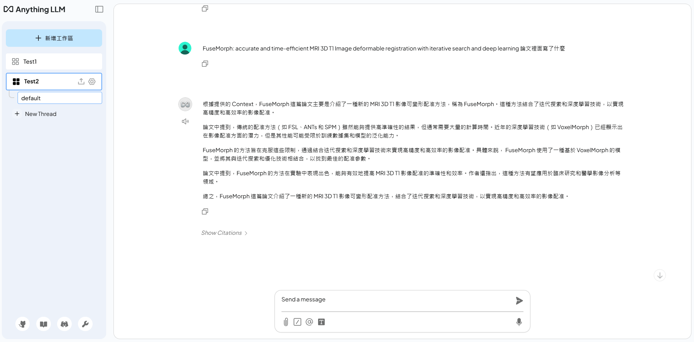
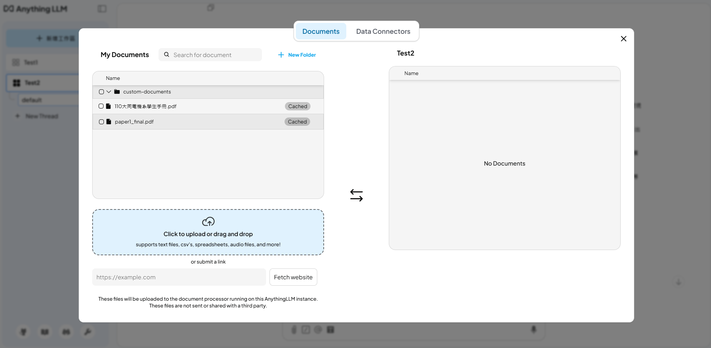

# OllamaLLM

OllamaLLM is a containerized project designed to simplify the deployment and use of large language models. This project includes multiple scripts and configurations to help you quickly start and run the Ollama service.

## Directory Structure

- `ollama_api_request_demo.py`: Demonstrates how to send requests to the Ollama API using Python.
- `run_Anythingllm.sh`: Script to start the AnythingLLM service.
- `run_Ollama_docker.sh`: Script to pull and run the Ollama Docker image.
- `Ollama_script.sh`: Script to list available models and run specific models.

## Quick Start

### 1. Start the Ollama Service

First, ensure that Docker is installed. Then, run the `run_Ollama_docker.sh` script to start the Ollama service:

```bash
bash run_Ollama_docker.sh
```

This script will pull the latest Ollama image and run the container in the background. By default, the service will be mapped to port 11434 on the host machine.

### 2. Send API Requests Using Python

After starting the service, you can use the `ollama_api_request_demo.py` script to test API requests:

```bash
python ollama_api_request_demo.py
```

This script sends a request with a prompt to the Ollama service and prints the response.

## Start AnythingLLM

If you want to start the AnythingLLM service, run the `run_Anythingllm.sh` script:

```bash
bash run_Anythingllm.sh
```

This script creates the necessary storage directory and `.env` file, then starts the AnythingLLM Docker container. By default, the service will be mapped to port 3001 on the host machine.

## Run Specific Models

You can use the `Ollama_script.sh` script to list available models and run specific ones:

```bash
bash Ollama_script.sh
```

This script will list available Ollama models and run specified models, such as `Llama-3-Taiwan-8B-Instruct-gguf` and `Llama-3-Taiwan-70B-Instruct-gguf`.

## Visual Overview

Here is a visual representation of the system setup and knowledge base creation:

### Dashboard



### Knowledge Base Creation



## Notes

- Ensure you have the appropriate execution permissions before running any scripts.
- Adjust the configurations in the scripts, such as storage paths and port numbers, to match your system environment.
- For more information, refer to the official documentation or contact the project maintainer.

We hope this project helps you deploy and use large language models with ease!
