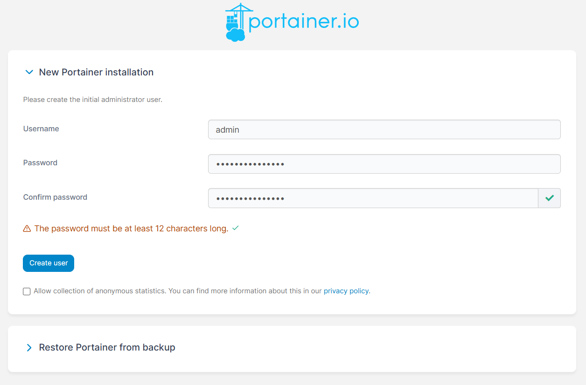
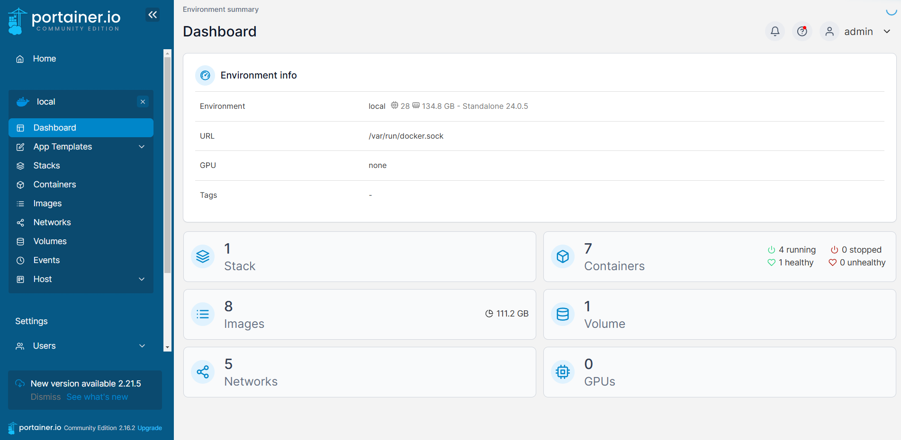
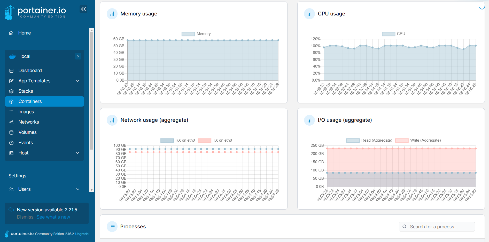

# Portainer Setup and Overview

## Introduction
Portainer is a lightweight management UI for Docker that allows you to easily manage your Docker environments. This guide provides the steps to set up Portainer using Docker, along with an overview of its features.

## Features

- **New Installation**: Create a secure admin user for your Portainer setup.
  

- **Dashboard**: Monitor your Docker environment, including stacks, containers, images, volumes, and networks.
  

- **Resource Monitoring**: Track CPU, memory, network, and I/O usage of containers in real-time.
  

## Prerequisites

- Docker must be installed on your system.

## Setup Instructions

1. Download the `run_portainer.sh` script.
2. Run the script:
   ```bash
   bash run_portainer.sh
   ```
3. Access the Portainer UI at:
   ```
   http://localhost:9000
   ```

### Script Overview
The `run_portainer.sh` script:

- Checks if Docker is installed.
- Removes existing Portainer containers.
- Runs the Portainer container on ports `8000` and `9000`.
- Sets the container to restart automatically on system reboot.

## Troubleshooting

If the container fails to start, review the logs using:

```bash
docker logs portainer
```

## Notes
- Ensure your Docker installation is up-to-date.
- Use strong passwords when setting up the admin user.

---

Feel free to explore the Portainer interface to manage your Docker containers effectively!
