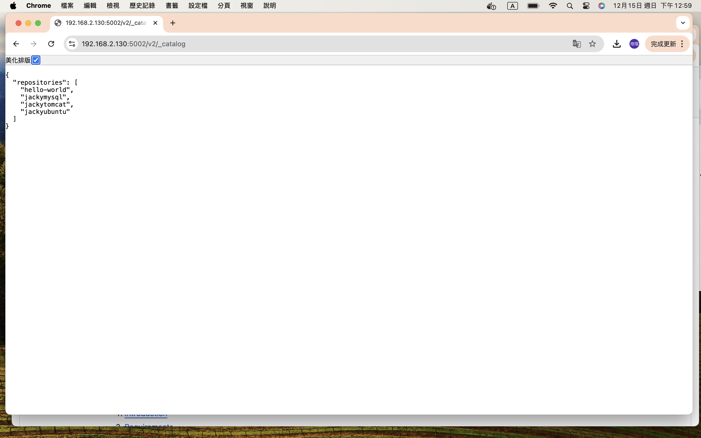

# Configuring Docker to Trust a Private Registry

## Table of Contents
1. [Introduction](#introduction)
2. [Requirements](#requirements)
3. [Setup on macOS](#setup-on-macos)
4. [Setup on Linux](#setup-on-linux)
5. [Validation](#validation)

---

## Introduction

This guide explains how to configure Docker to trust a self-signed certificate for a private Docker registry. By following this guide, you will ensure secure communication between Docker clients and your private registry at `https://192.168.2.130:5002`.

---

## Requirements

- **Operating Systems**:
  - macOS Monterey or later
  - Ubuntu 20.04 or later
- **Software**:
  - Docker 20.10 or later
  - OpenSSL for generating self-signed certificates
  - A browser for HTTPS testing

---

## Setup on macOS

### 1. Generate Self-Signed Certificate

On the private registry server, generate a self-signed certificate:
```bash
cd Registry
mkdir -p certs auth data
openssl req -x509 -newkey rsa:4096 -nodes -keyout certs/cert.key -out certs/cert.crt -days 365 \
  -subj "/CN=192.168.2.130" \
  -addext "subjectAltName=IP:192.168.2.130"
```

### 2. Configure the Registry

Start the Docker registry with the generated certificate:
```bash
docker run -d -p 5002:5000 --name registry \
  -v "$(pwd)/auth:/auth" \
  -v "$(pwd)/certs:/certs" \
  -v "$(pwd)/data:/var/lib/registry" \
  -e REGISTRY_HTTP_TLS_CERTIFICATE=/certs/cert.crt \
  -e REGISTRY_HTTP_TLS_KEY=/certs/cert.key \
  -e REGISTRY_AUTH=htpasswd \
  -e REGISTRY_AUTH_HTPASSWD_REALM="Registry Realm" \
  -e REGISTRY_AUTH_HTPASSWD_PATH=/auth/htpasswd \
  registry:2
```

### 3. Trust the Certificate on macOS

#### Step 1: Rename the certificate file
Before proceeding, rename cert.crt to ca.crt:
```bash
mv /Users/username/Desktop/cert.crt /Users/username/Desktop/ca.crt
```

#### Step 2: Add the certificate to the macOS trust store
Add the ca.crt file to the system trust store:
```bash
sudo security add-trusted-cert -d -r trustRoot -k /Library/Keychains/System.keychain /Users/username/Desktop/ca.crt
```

Replace /Users/username/Desktop/ca.crt with the actual path of your certificate.

## Setup on Linux

### 1. Generate Self-Signed Certificate
Follow the same steps as in macOS to generate the certificate.

### 2. Configure the Registry
Follow the same steps as in macOS to configure the registry.

### 3. Trust the Certificate on Linux

#### Step 1: Rename the certificate file
Rename cert.crt to ca.crt:
```bash
mv /path/to/cert.crt /path/to/ca.crt
```

#### Step 2: Add the certificate to Docker's trusted directory
Copy the ca.crt file to the correct Docker directory:
```bash
sudo mkdir -p /etc/docker/certs.d/192.168.2.130:5002
sudo cp /path/to/ca.crt /etc/docker/certs.d/192.168.2.130:5002/ca.crt
```

#### Step 3: Restart Docker to apply the changes
```bash
sudo systemctl restart docker
```

## Validation

### Test Using a Browser
Open a browser and navigate to:
```bash
https://192.168.2.130:5002/v2/_catalog
```
You should see a JSON response like the following, showing the repositories stored in your private registry:


### Test Using Docker and Using the Private Docker Registry
#### Step 1:Log into the private registry:
```bash
docker login https://192.168.2.130:5002
```
You should see
```bash
Login Succeeded
```

#### Step 2: Tag the Image
Tag your local image with the address of the private registry. For example, if you have an image called hello-world:
ˋˋˋbash
docker tag hello-world 192.168.2.130:5002/hello-world
ˋˋˋ

#### Step 3: Push the Image to the Registry
Push the tagged image to the private registry using the following command:
ˋˋˋbash
docker push 192.168.2.130:5002/hello-world
ˋˋˋ

### Step 4: Pull the Image from the Registry 
To confirm that the image was successfully pushed, you can pull it back from the registry:
ˋˋˋbash
docker pull 192.168.2.130:5002/hello-world
ˋˋˋ

### Verify Using curl
You can also verify the image repository and tags using curl. For example:
- **List all repositories**:
ˋˋˋbash
curl -u jacky:123456 https://192.168.2.130:5002/v2/_catalog
ˋˋˋ

- **Check the tags of a specific repository**:
ˋˋˋbash
curl -u jacky:123456 https://192.168.2.130:5002/v2/hello-world/tags/list
ˋˋˋ
