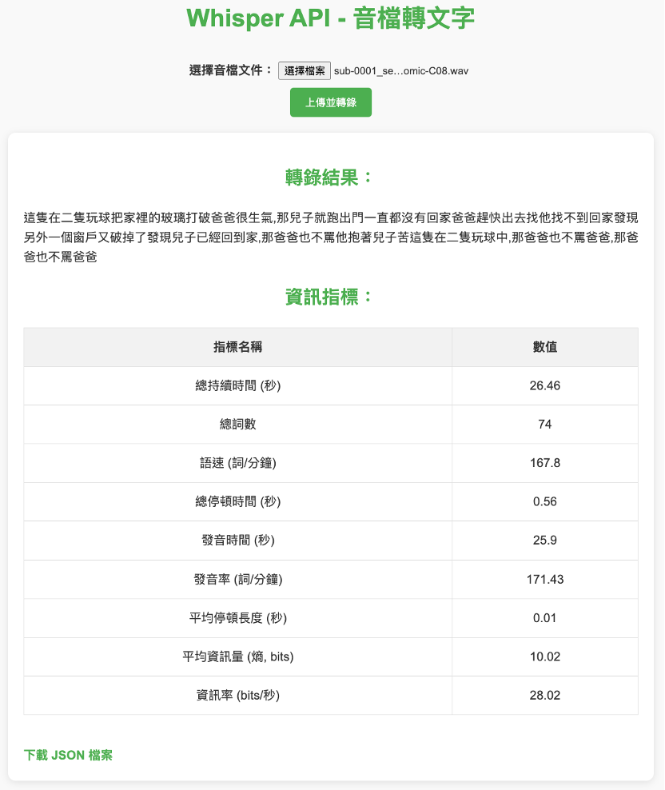

# Whisper API — Speech‑to‑Text Service

> A lightweight RESTful API and web front‑end powered by [OpenAI Whisper](https://github.com/openai/whisper). Upload an audio file (WAV/MP3/FLAC…) and receive an instant transcription plus detailed speech analytics in JSON format.

---

## Features

* **Multilingual Recognition** – automatic language detection with accurate transcripts.
* **Rich JSON Output** – words per minute, speech/pause duration, bitrate, entropy and more.
* **Dockerised Deployment** – one‑click shell script downloads the model, builds the image and spins up the container.
* **Simple Web UI** – drag‑and‑drop file upload with live results (see screenshot below).



---

## Quick Start

### 1 · Requirements

| Component                    | Minimum Version |
| ---------------------------- | --------------- |
| Docker                       | 20.10 +         |
| NVIDIA driver (optional GPU) | 470.xx +        |
| nvidia‑container‑toolkit     | any             |

> **No GPU?** Remove `--gpus all` in the run command and use a CPU‑only PyTorch wheel in the Dockerfile. Inference will be slower but still functional.

### 2 · One‑Click Deployment

```bash
# Run inside the project root (contains this README and run_whisper_api.sh)
chmod +x run_whisper_api.sh
./run_whisper_api.sh
```

The script will automatically:

1. Pull the `python:3.10` base image.
2. Use a **temporary** container to install Whisper and execute `download_model.py` (default model: **large**).
3. Build the final `whisper-api` image.
4. Launch `whisper-api-container` and expose [http://localhost:5005](http://localhost:5005).

---

## API Reference

### `POST /transcribe`

| Field | Type                | Description           |
| ----- | ------------------- | --------------------- |
| file  | multipart/form‑data | Audio file to convert |

**Sample Response**

```json
{
  "text": "The kids were playing ball and broke the window...",
  "stats": {
    "duration_sec": 26.46,
    "word_count": 74,
    "wpm": 167.8,
    "total_silence_sec": 0.56,
    "speech_time_sec": 25.9,
    "speech_rate_wpm": 171.43,
    "avg_silence_len_sec": 0.01,
    "avg_entropy_bits": 10.02,
    "bitrate_bps": 28.02
  }
}
```

| HTTP Code | Meaning                   |
| --------- | ------------------------- |
| 400       | No file or invalid format |
| 500       | Internal server error     |

---

## Manual Workflow (Optional)

```bash
# 1 · Download the model
python download_model.py  # requires: pip install git+https://github.com/openai/whisper.git

# 2 · Build the image
docker build -t whisper-api .

# 3 · Run the container
docker run -dit --gpus all -p 5005:5000 --name whisper-api-container whisper-api
```

---

## Project Structure

```
Whisper/
├─ Dockerfile
├─ run_whisper_api.sh        # one‑click deploy script
├─ download_model.py         # model downloader
├─ whisperAPI.py             # Flask/FastAPI entry point
├─ templates/                # HTML templates
├─ models/                   # downloaded Whisper models
├─ utils/                    # utility functions
├─ Display.png               # UI screenshot
├─ *.wav / audio samples     # test audio files
└─ README.md
```

---

## FAQ

<details>
<summary><strong>How can I use a smaller model?</strong></summary>
Edit `download_model.py` (or pass an argument) to fetch `small`, `medium`, etc. This reduces download size and RAM usage.
</details>

<details>
<summary><strong>Can I run without a GPU?</strong></summary>
Yes. Build the image with CPU‑only PyTorch and remove `--gpus all` when running the container. Expect slower performance.
</details>

---

## License

Released under the MIT License – see `LICENSE` for details.
